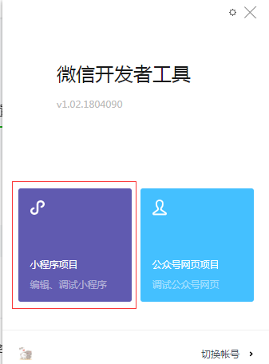
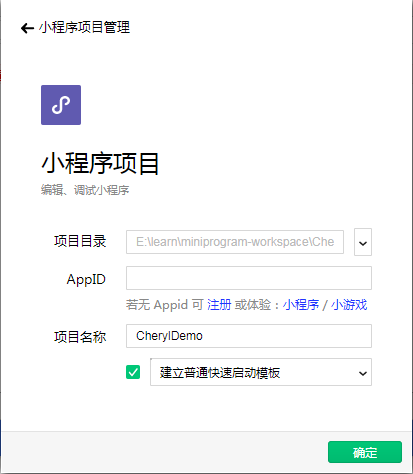
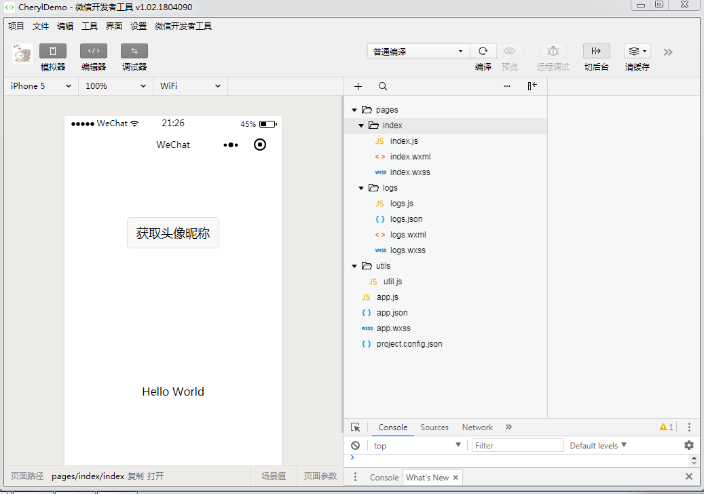

# 快速搭建小程序项目

---

## 开发工具安装

微信公众平台提供了winddows64,windows32,mac三个操作系统下的安装包，我们选择合适自己下载即可。（[微信开发者工具下载链接](https://developers.weixin.qq.com/miniprogram/dev/devtools/download.html)）

>备注： 小程序的开发工具除了使用官方提供的微信开发者工具之外，还可以使用SublimeText,或者是WebStrom等，然后配合使用微信开发者工具进行调试操作。

## 快速创建项目

在根据提示安装完成之后，我们需要用微信扫描二维码登录微信开发者工具。然后选择小程序项目

然后我们选择小程序存放的位置，填写对应的demo，选择体验小程序，并且勾选建立普通快速启动模板。

这里我们先使用无appId的方式即体验模式，虽然无法进行代码真机预览和上传等操作，部分 API 无法正常调用，但是不影响我们正常的开发。项目创建完如下图所示

> 关于开发工具再此不做详细说明，详情可以参考[小程序开发工具介绍](https://developers.weixin.qq.com/miniprogram/dev/devtools/page.html#%E5%90%AF%E5%8A%A8%E9%A1%B5)

## 项目结构介绍

### 小程序文件类型

小程序中有且只有以下4中类型的文件：

- json 后缀的 JSON 配置文件
- wxml 后缀的 WXML 模板文件
- wxss 后缀的 WXSS 样式文件
- js 后缀的 JS 脚本逻辑文件

### 包结构

小程序的默认的包结构如下所示

<pre>
+- pages
	+- indexs
		- index.js
		- index.json
		- index.wsml
		- index.wxss
	+- logs
		- logs.js
		- logs.json
		- logs.wsml
		- logs.wxss
+- utils
	- util.js
app.js
app.json
app.wxss
project.config.json
</pre> 

所有的配置遵循就近原则

### 包结构说明

1.app.json 小程序逻辑（必须）
> app.json中的App() 函数用来注册一个小程序。接受一个 object 参数，其指定小程序的生命周期函数等。

2.app.json 小程序公共设置（必须）
> app.json文件用来对微信小程序进行全局配置，决定页面文件的路径、窗口表现、设置网络超时时间、设置多 tab 等。

3.app.wxss 全局样式文件 
> 在app.wxss中可以定义一些全局属性的样式，这样相同的养生石在单独的页面中就无需在配置了。

4.project.config.json 是工具配置文件。

> 所有对当前开发工具做的操作都会保存到project.config.json文件中，当我们重新安装工具或者是更换电脑时，只需导入项目的代码即可恢复我们之前对工具的一些设置。

 
5.pages 小程序模板存放的文件夹
> 在小程序中所有的模板都在此文件中，并且每一个页面对应中有4个文件
> <table border="1">
	  <tr>
	    <th>文件类型</th>
	    <th>必填</th>
	    <th>作用</th>
	  </tr>
	  <tr>
	    <td>js</td>
	    <td>是</td>
	    <td>页面逻辑</td>
	  </tr>
	  <tr>
	    <td>wxml</td>
	    <td>是</td>
	    <td>页面结构</td>
	  </tr>
      <tr>
	    <td>wxss</td>
	    <td>否</td>
	    <td>页面样式表</td>
	  </tr>
      <tr>
	    <td>json</td>
	    <td>否</td>
	    <td>页面配置</td>
	  </tr>
</table>
>- 为了方便开发者减少配置项，描述页面的四个文件必须具有相同的路径与文件名。  
>- 页面中的wxss样式配置如果与app.wxss有相同的，那么采取就近原则，优先使用页面的样式。 
>- 小程序的页面是可以嵌套的，对应的可以有二级页面，三级页面等等，但是最多只能支持5级页面，这一点主要是从小程序的性能方面考虑，从而做的限制。  

