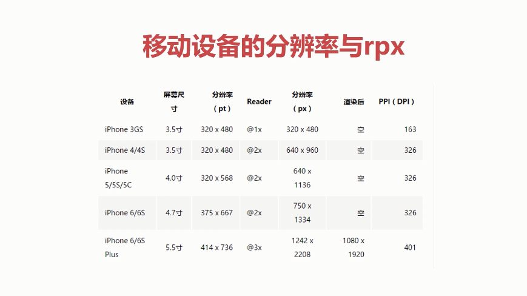
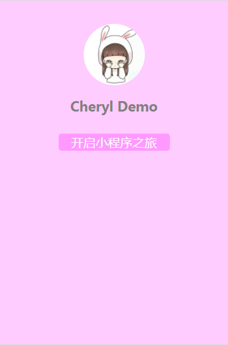
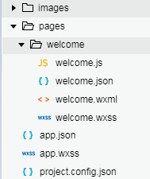
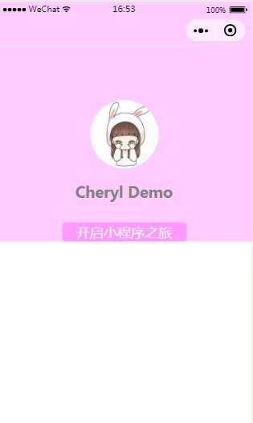

#编写一个简单的页面

---

> 开发前准备， 创建一个空的项目，建立小程序中必须的文件app.json，app.wxss以及pages文件夹,以及。然在pages下面创建welcome文件夹，然后建立对应welcome.wxml,welcome.wxss文件
> 

## 移动端的分辨率与rpx

在开始编写页面之前我们首先要了解一下分辨率的概念，因为小程序是移动端的开发，在不同的机型中是需要进行适配的，所以要注意像素的使用。

- pt  逻辑分辨率，pt的大小与屏幕尺寸与关系，简单可以理解为长度和视觉单位
- px  物理分辨率，与屏幕尺寸没有关系，用于描述一个单位中像素点的多少
- reader 设备像素比 一个pt包含多少个px，人类视觉极限为@2x
- ppi(dpi） 每一寸包含的px

从上述图中可以看出1个pt可以有1个px构成也可以有2个，甚至是3个...

小程序推荐的使用的单位是rpx。他和px之间的关系为 1rpx = 1px 。 唯一的区别就是rpx可以根据屏幕进行适配，而px不可以。
 
### 扩展
* 不是所有的单位都适合rpx  
 当需要的元素大小适应屏幕尺寸，就选择rpx作为单位，否者使用px作为单位。一般来说文字不建议使用rpx；建议margin-top，margint-bottom 使用rpx,因为屏幕是可以进行垂直滚动的，而margin-left，margin-right使用px，当然这个不是绝对的也是根据具体问题具体分析的。

* 为什么使用ip6的物理分辨率来设计UI?  
小程序的模拟器采用的是逻辑分辨率。在设计时采用的就是根据iphone6的屏幕来设计的。所以存在:1px = 1rpx=2pt。方便开发，所以在调试时使用iphone6模拟器进行调试。

* 为什么iphone plus 的设备相素比大于iphone6的，但是图像并没有更清晰呢？  
从理论上来说同一个单位的包含的物理像素点多，显示的图像会更细腻，更清晰，但是人类的极限的2备的像素比，所以虽然iphone6 plus 的像素比为3备的像素比但是我们视觉上并没有太大的感觉。

## 一个简单页面
下图是我们将要实现的一个页面。  

### 创建文件
首先创建一个空的项目，建立小程序中必须的文件app.json，app.wxss以及pages文件夹,以及。然在pages下面创建welcome文件夹，然后建立对应welcome.wxml,welcome.wxss文件。
  

 

创建完之后我们需要把页面注册的小程序中，也就是配置到app.json的pages中。否则是不可以预览这个页面的。
<pre>
{
  "pages": [
    "pages/welcome/welcome"   
   ]
}
</pre>

> 小程序中规定，pages下面的第一个页面，默认为显示的第一个页面  
> 

### 编写welcome.wxml

小程序中有一个基本的视图容器view,类似于html里面的div,用来分割页面中的不同部分。文字可以直接写也可使用text标签包围。 

	<view class='container'>
	  <image class="welcome-avatar" src='/images/welcome.jpg'></image>
	  <text class="welcome-title">Cheryl  Demo</text>
	  <view class='moto-container'>
	    <text class='moto'>开启小程序之旅 </text>
	  </view>
	</view>

- text标签的相关Tips  
>- 使用text包围的文字可以添加自定义样式，也可在手机中可以长按选中。
>- 可以识别转移字符,例如\n识别为换行   
>- 各个操作系统的空格标准并不一致。  
>- <text/> 组件内只支持 <text/> 嵌套。  

在编写完页面之后，编写对应的wxss文件。
<pre>
/* pages/welcome/welcome.wxss */
.container{
  display:flex;/*变成弹性模型*/
  flex-direction: column;/*垂直布局*/
  align-items: center;/* 居中对齐 */
}
.welcome-avatar{
  width: 200rpx;
  height: 200rpx;
  margin-top: 160rpx;
  /*图片显示成圆形  */
  border-radius: 500px; 
}
.welcome-title{
  font-size: 22px;
   font-weight: bold; 
  margin-top: 40rpx;
  color:  gray;
}
.moto-container{
  border: 1px solid #FF99FF;
  border-radius: 5px;
  margin-top: 60rpx;
  background-color: #FF99FF;
}
.moto{
  font-size: 20px;
  color: #ffffff;
  padding: 20px;
}

page{
  background-color: #FFCCFF;
}
</pre>

在小程序中不需要引入 wxss,因为app.json的pages中注册页面的时候无需指明具体的文件，所以pages可以自动的把welcome中4中不同类型的文件关联在一起。

> 在wxml中样式可以使用class也可以使用style设置，建议静态样式放在wxss中有class指明，动态样式放在style。

- 可能遇到的问题  
在设置页面背景色的时候，如果我们在.container{}中设定了 background-color,那么会出现如下的结果  

[解决方法]  
- 指定height:1334rpx;但是如果换在其他模拟器中还是会出现上述问题。  
- 指定height:100% 也无法实现预期的效果，原因的container中是有元素扩充起来的。  
- 注意小程序默认在我们编写的骨架外面包裹了一个page标签，可以通过这个标签来设置整屏的颜色。

