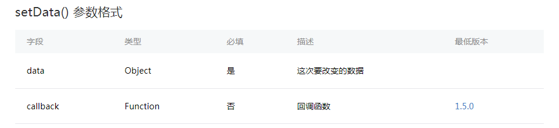

# js的文件结构与生命周期
---
>在介绍数据绑定之前，我们需要了解一个js文件的结构和的生命周期，以及进行数据初始化的操作。

## js文件的文件结构
我们首先了解一下小程序默认的js的文件结构：
<pre>
Page({
  data: {}, //页面的初始数据
  onLoad: function (options) {},// 生命周期函数--监听页面加载
  onReady: function () {}, //生命周期函数--监听页面初次渲染完成
  onShow: function () {},// 生命周期函数--监听页面显示
  onHide: function () {},//生命周期函数--监听页面隐藏
  onUnload: function () {},//生命周期函数--监听页面卸载
  onPullDownRefresh: function () {},//页面相关事件处理函数--监听用户下拉动作
  onReachBottom: function () {},//页面上拉触底事件的处理函数
  onShareAppMessage: function () {}//用户点击右上角分享
})
</pre>

Page() 函数用来注册一个页面。接受一个 object 参数，其指定页面的初始数据、生命周期函数、事件处理函数等。。

## 生命周期函数

- onLoad: 页面加载
> 一个页面只会调用一次，可以在 onLoad 中获取打开当前页面所调用的 query 参数。  
> 页面的初始化操作是在onLoad函数中进行的。 
 
- onShow: 页面显示
> 每次打开页面都会调用一次。

- onReady: 页面初次渲染完成
> 一个页面只会调用一次，代表页面已经准备妥当，可以和视图层进行交互。  
> 对界面的设置如wx.setNavigationBarTitle请在onReady之后设置。详见生命周期

- onHide: 页面隐藏
> 当navigateTo或底部tab切换时调用。

- onUnload: 页面卸载
> 当redirectTo或navigateBack的时候调用。

## 数据初始化

初始化数据将作为页面的第一次渲染。data 将会以 JSON 的形式由逻辑层传至渲染层，所以其数据必须是可以转成 JSON 的格式：字符串，数字，布尔值，对象，数组。

- Page.prototype.setData()  
setData 函数用于将数据从逻辑层发送到视图层（异步），同时改变对应的 this.data 的值（同步）。

> this.data在122100版本中已经失效但是不会编译报错，但是数据是无法展示出来的，所以请使用this.setData()赋值。小程序是会读取data对象来做数据绑定，这个动作实在onLoad事件执行之后发生的。

例如：
<pre>
 var postitem={
    date: "2018-03-29",
    title: "百变狸猫",
    imgSrc: "/images/post/bblm.png",
    avatar: "/images/avatar/1.png",
    content: "那个比宫崎骏还会讲故事的人走了，这部片最适合纪念他",
    reading: "112",
    collection: "96"
  }

  this.setData({
      postitem: postitem
  })
</pre>