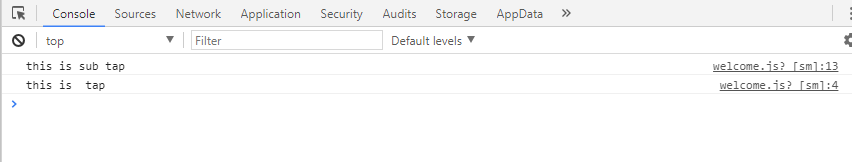

# 页面跳转

到目前为止我们已经有了两个页面，我们需要通过点击weclome页面的“开启小程序之旅按钮”跳转到电影资讯列表页面。那么如何把他们关联起来呢？

## 触发点击事件

首先需要触发按钮的点击事件。在小程序中是不存在click事件的，而是tap事件(在手指触摸之后马上离开的时候触发)。在js中我们给一个标签绑定事件方式是onxxx，而在小程序中使用的是bindxx,例如bindtap。

1、为按钮添加点击事件  

	<view class='moto-container' bindtap='onTap'>
	   <text class='moto'>开启小程序之旅 </text>
	</view>

>-  事件绑定的写法同组件的属性，以 key、value 的形式。  
>-  key 以bind或catch开头，然后跟上事件的类型，如bindtap、catchtouchstart。自基础库版本 1.5.0 起，bind和catch后可以紧跟一个冒号，其含义不变，如bind:tap、、catch:touchstart。  
>- value 是一个字符串，需要在对应的 Page 中定义同名的函数。不然当触发事件的时候会报错。

2、在weclcome.js脚本文件中定义onTap事件
<pre>
 onTap: function (event) {
	console.log('this is ontap event')
 }
</pre>

## 页面跳转

### 页面导航方式
小程序中提供了5种页面导航的方式，这里我们先简单的了解下面两种：

- wx.navigateTo()
> 保留当前页面，跳转到应用内的某个页面，使用wx.navigateBack可以返回到原页面。相当于父页面跳转到子页面。  
> 因为navigateTo属于隐藏页面所以触发了生命周期函数onHide。

- wx.redirectTo()
> 关闭当前页面，跳转到应用内的某个页面。  
> 因为nredirectTo属于关闭页面所以触发了生命周期函数onUnload。

通过上述api我们了解到使用 redirectTo即可实现我们的功能。因为welcome只是一个启动页面，和电影资讯页面不存在返回关系。

<pre>
onTap: function (event) {
   wx.redirectTo({
     url: '../posts/post'
   })
}
</pre>

> 这里的url建议使用相对路径。

## 事件冒泡与非冒泡

- 冒泡事件：当一个组件上的事件被触发后，该事件会向父节点传递。
- 非冒泡事件：当一个组件上的事件被触发后，该事件不会向父节点传递。

在wxml中属于冒泡事件的还是很多的，例如tap，longtap,touchstart，touchend,touchmove等等事件。这里以tap为例：

	 <view class='moto-container' bindtap='onTap'>
	    <text class='moto' bindtap='onSubTap'>开启小程序之旅 </text>
	 </view>

我们给view和text都绑定了tap，然后定义onTap和onSubTap事件。
<pre>
Page({
  onTap: function (event) {
    console.log("this is  tap");
  },
  onSubTap: function () {
    console.log("this is sub tap");
  }
})
</pre>
在点击文字的时候,可以在控制台看到，会先执行onSubTap,随后再执行onTap。

那么阻止事件的冒泡呢？

小程序的事件绑定提供了两种方式，一种是bind , 一种是catch。其中bind事件绑定不会阻止冒泡事件向上冒泡，catch事件绑定可以阻止冒泡事件向上冒泡。  
这里可以使用catchTap来组织事件的冒泡。

